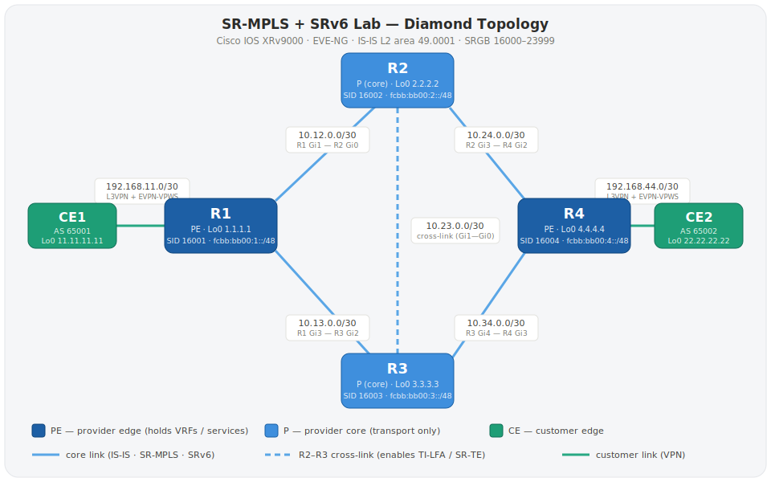

# SR-MPLS + SRv6 Lab — Cisco IOS XRv9000 / EVE-NG


> **How to use this lab:**
> Follow the phases one by one. Paste the config, run the verify commands, make sure it works — *then* move to the next phase. You don't need to understand everything upfront. The concepts will click as you build.
>
> Want to read the theory first? → [`docs/CONCEPTS.md`](docs/CONCEPTS.md)

---

## TL;DR — quick start

For those who already know IOS XR and just want to build it:

1. Draw the topology in EVE-NG (6 nodes, links in the [table below](#topology--draw-this-in-eve-ng)).
2. Paste each device's full config from [`configs/`](configs/) — `R1.txt`–`R4.txt`, `CE1.txt`, `CE2.txt` are cumulative (all 7 phases).
3. Verify end to end:

```
! on R1 — transport reachable
ping 4.4.4.4 source Loopback0

! on CE1 — L3VPN works
ping vrf CUST-A 22.22.22.22 source 11.11.11.11    ! (run from PE) 
ping 22.22.22.22 source 11.11.11.11                ! (run from CE1)

! on CE1 — L2VPN (EVPN-VPWS) works
ping 172.16.0.2 source 172.16.0.1
```

All `!!!!!` → the whole stack (IS-IS → SR-MPLS → TI-LFA → SR-TE → L3VPN → SRv6 → EVPN-VPWS) is up. Want to learn instead of speed-run? Skip this and follow the phases below.

---

## What this lab builds

A real service-provider network using **Segment Routing** — the modern way to do MPLS. You will build it from scratch in 7 phases:

```
Phase 1 → IS-IS (routing foundation)
Phase 2 → SR-MPLS (labels without LDP — the main idea)
Phase 3 → TI-LFA (automatic fast reroute)
Phase 4 → SR-TE (traffic engineering — steer traffic anywhere)
Phase 5 → L3VPN (carry customer IP traffic)
Phase 6 → SRv6 (next-gen: IPv6-based transport)
Phase 7 → EVPN-VPWS (carry customer Layer 2 traffic)
```

Each phase adds one thing. If something breaks, you only need to look at what you just added.

---

## Before you start

**You need:**
- EVE-NG (Community or Pro) installed and running
- Cisco IOS XRv9000 image loaded into EVE-NG (tested on 24.3.1)
- 6 nodes in your topology: R1, R2, R3, R4, CE1, CE2

**Good to know (but not required yet):**
- Basic IOS XR CLI — how to enter config mode, `commit`, `show` commands
- What IS-IS is (a routing protocol, like OSPF)
- What MPLS is (labels on packets for fast forwarding)

---

## Topology — draw this in EVE-NG



<details>
<summary>Same topology as ASCII (copy-paste friendly)</summary>

```
                +--------+
     +----------+   R2   +----------+
     |          |  (P)   |          |
     |          +---+----+          |
     |              |               |
+----+----+         |          +----+----+
|   R1    +---------+----------+   R4    |
|  (PE)   |    via R2–R3       |  (PE)   |
+----+----+                    +----+----+
     |          +--------+         |
     +----------+   R3   +---------+
     |          |  (P)   |         |
     |          +--------+         |
     |                             |
+----+----+                   +----+----+
|   CE1   |                   |   CE2   |
+---------+                   +---------+
```

</details>

**Roles:**
- **PE** (Provider Edge) = R1 and R4. These connect to customers (CE1, CE2).
- **P** (Provider core) = R2 and R3. These just forward packets — no customer config.
- **CE** (Customer Edge) = CE1 and CE2. Simple routers that don't know about MPLS.

**Core links to create in EVE-NG** (these carry IS-IS / SR / SRv6):

| Link | Interface on left | Interface on right | Subnet |
|------|-------------------|--------------------|--------|
| R1 – R2 | R1 Gi0/0/0/1 | R2 Gi0/0/0/0 | 10.12.0.0/30 |
| R1 – R3 | R1 Gi0/0/0/3 | R3 Gi0/0/0/2 | 10.13.0.0/30 |
| R2 – R3 | R2 Gi0/0/0/1 | R3 Gi0/0/0/0 | 10.23.0.0/30 |
| R2 – R4 | R2 Gi0/0/0/3 | R4 Gi0/0/0/2 | 10.24.0.0/30 |
| R3 – R4 | R3 Gi0/0/0/4 | R4 Gi0/0/0/3 | 10.34.0.0/30 |

**Customer links** (added in Phases 5–7):

| Link | Service | Interface on PE | Interface on CE | Subnet |
|------|---------|-----------------|-----------------|--------|
| R1 – CE1 | L3VPN (Phase 5) | R1 Gi0/0/0/0 | CE1 Gi0/0/0/1 | 192.168.11.0/30 |
| R4 – CE2 | L3VPN (Phase 5) | R4 Gi0/0/0/1 | CE2 Gi0/0/0/0 | 192.168.44.0/30 |
| R1 – CE1 | L2VPN / EVPN-VPWS (Phase 7) | R1 Gi0/0/0/2 | CE1 Gi0/0/0/2 | 172.16.0.0/24 |
| R4 – CE2 | L2VPN / EVPN-VPWS (Phase 7) | R4 Gi0/0/0/0 | CE2 Gi0/0/0/1 | 172.16.0.0/24 |

> Interface numbers above match the shipped configs in [`configs/`](configs/) exactly — wire EVE-NG the same way or the pasted configs won't line up.

---

## IP Address Plan — use exactly these addresses

### Loopbacks (one per router — very important for SR)

| Router | Loopback0 | SR Label | SRv6 Locator |
|--------|-----------|----------|--------------|
| R1 | 1.1.1.1/32 | **16001** | fcbb:bb00:1::/48 |
| R2 | 2.2.2.2/32 | **16002** | fcbb:bb00:2::/48 |
| R3 | 3.3.3.3/32 | **16003** | fcbb:bb00:3::/48 |
| R4 | 4.4.4.4/32 | **16004** | fcbb:bb00:4::/48 |

> **Why loopbacks matter:** In SR, label 16001 means "reach R1". Label 16004 means "reach R4". Every router in the network agrees on this. This is the whole magic of SR-MPLS.

### Links between routers

| Link | Subnet | R1 side | R2/R3/R4 side |
|------|--------|---------|---------------|
| R1–R2 | 10.12.0.0/30 | .1 | .2 |
| R1–R3 | 10.13.0.0/30 | .1 | .2 |
| R2–R3 | 10.23.0.0/30 | .1 (R2) | .2 (R3) |
| R2–R4 | 10.24.0.0/30 | .1 (R2) | .2 (R4) |
| R3–R4 | 10.34.0.0/30 | .1 (R3) | .2 (R4) |

### Customer links (Phases 5–7)

| Link | Subnet | PE side | CE side |
|------|--------|---------|---------|
| R1–CE1 | 192.168.11.0/30 | .1 | .2 |
| R4–CE2 | 192.168.44.0/30 | .1 | .2 |

| CE Router | Loopback0 | BGP AS |
|-----------|-----------|--------|
| CE1 | 11.11.11.11/32 | 65001 |
| CE2 | 22.22.22.22/32 | 65002 |

---

## How each phase below is laid out

Every phase follows the same shape so you can build *and understand*:

- **Goal** — what works at the end of this phase.
- **Why it matters** — the operator/interview reason this feature exists.
- **The config, line by line** — the exact block to paste, with a numbered breakdown of what each command does and why.
- **Verify + what to look for** — the `show` commands, and how to read their output.
- **📋 verify log** — a link to `notes/phaseN-…-verify.md` with the **real captured output** from this lab plus analysis.

Configs are **cumulative**: each phase adds to the previous one. The files in [`configs/`](configs/) are the *final* state of all 7 phases — if you'd rather build incrementally, paste only the block shown in each phase. Inline `!` comments in the blocks below mark per-router changes (e.g. `← 4.4.4.4 on R4`).

---

## Phase 1 — IS-IS Baseline

**Goal:** All 4 routers (R1–R4) can ping each other's loopbacks. This is the foundation everything else builds on.

**Config files:** [`configs/R1.txt`](configs/R1.txt) through [`configs/R4.txt`](configs/R4.txt) — paste the IS-IS section for each router.

### The config, line by line (R1 example)

```
router isis CORE                       ! (1) name the IS-IS process "CORE"
 is-type level-2-only                  ! (2) run Level-2 only — flat SP backbone
 net 49.0001.0000.0000.0001.00         ! (3) area 49.0001, system-id ...0001 (unique!)
 address-family ipv4 unicast
  metric-style wide                    ! (4) 32-bit wide metrics — MANDATORY for SR
 !
 interface Loopback0
  passive                              ! (5) advertise Lo0, but no hellos on it
  address-family ipv4 unicast
  !
 !
 interface GigabitEthernet0/0/0/1      ! a core link (to R2)
  point-to-point                       ! (6) P2P — no DIS election, faster up
  address-family ipv4 unicast
  !
 !
 interface GigabitEthernet0/0/0/3      ! a core link (to R3)
  point-to-point
  address-family ipv4 unicast
  !
 !
!
commit
```

**What each part does:**

1. **`router isis CORE`** — starts an IS-IS process. The name `CORE` is local-only; it just has to match in your own `show` commands.
2. **`is-type level-2-only`** — IS-IS has two levels (L1 = area-internal, L2 = between areas). Service-provider backbones run a single flat **L2** domain, so we disable L1 entirely. Fewer LSPs, no L1/L2 route leaking to reason about.
3. **`net 49.0001.0000.0000.0001.00`** — the NET is IS-IS's "address." Read it as **area** `49.0001` + **system-id** `0000.0000.0001` (must be unique per router — here the last octet is the router number) + **NSEL** `00` (always 00 on a router). All four routers share area `49.0001` so they're one domain.
4. **`metric-style wide`** — switches from the legacy 6-bit metrics to 32-bit "wide" metrics. **This is not optional for SR:** prefix-SIDs and other SR sub-TLVs only ride inside wide-metric TLVs. Forget it and SR silently won't work later.
5. **`interface Loopback0 / passive`** — advertises `Lo0`'s /32 into IS-IS but sends **no** hellos on it (you can't form an adjacency over a loopback anyway, and `passive` keeps it from being probed). That /32 is what every prefix-SID will attach to in Phase 2.
6. **`point-to-point`** on each core link — tells IS-IS to treat the link as P2P instead of broadcast. On P2P links there's **no DIS election and no pseudonode**, so adjacencies come up faster and the LSDB is simpler. Every link in this lab is P2P.

> **Per-router change:** only the NET's system-id differs — R1 `...0001`, R2 `...0002`, R3 `...0003`, R4 `...0004`. And each router lists *its own* core interfaces (see the topology table).

**✅ Verify — run on R1:**
```
show isis neighbors            ! are the adjacencies up?
show route 4.4.4.4/32          ! can we reach R4's loopback, and via how many paths?
ping 4.4.4.4 source Loopback0  ! does traffic actually flow?
```

**What to look for:**

- `show isis neighbors` → **R2 and R3 both `Up`**, Type `L2`, SNPA `*PtoP*`. If a neighbor is missing, check that both ends have the interface in IS-IS and set to `point-to-point`.
- `show route 4.4.4.4/32` → reachable as `i L2` over **two equal-cost paths** (via R2 *and* via R3) — that's the diamond giving you ECMP. The non-best path is tagged `(!)`.
- `ping 4.4.4.4 source Loopback0` → `!!!!!` (5/5).

📋 **Real captured output + analysis:** [`notes/phase1-isis-verify.md`](notes/phase1-isis-verify.md)

---

## Phase 2 — SR-MPLS (Prefix-SIDs)

**Goal:** Each router gets a globally unique label. R1 can reach R4 using label 16004 — no LDP needed.

**Why it matters:** In classic MPLS you run **LDP** (or RSVP-TE) purely to hand out labels. SR deletes that whole protocol: IS-IS itself advertises one globally-agreed label — the **prefix-SID** — for each loopback. Fewer protocols, simpler core, easier troubleshooting. This is *the* reason operators moved to SR.

### The config, line by line

```
router isis CORE
 address-family ipv4 unicast
  segment-routing mpls                 ! (1) turn on SR in the MPLS data plane
 !
 interface Loopback0
  address-family ipv4 unicast
   prefix-sid index 1                  ! (2) this node's SID index (R1=1 … R4=4)
  !
 !
!
commit
```

**What each part does:**

1. **`segment-routing mpls`** (under the IPv4 address-family) — enables SR forwarding and claims the default **SRGB** (Segment Routing Global Block), the label range **16000–23999**. Every router uses the same block, which is why a label means the same thing everywhere.
2. **`prefix-sid index 1`** (under `Loopback0`) — assigns this router an **index**, not a label. The actual label = **SRGB base (16000) + index**. So index 1 → label **16001**, index 4 → **16004**. You configure the *index*; IS-IS floods it; every other router computes the same label. Change it per router: R1 `1`, R2 `2`, R3 `3`, R4 `4`.

> **Index vs label — why indexes?** If you ever change the SRGB base, every label shifts but the *indexes* stay the same, so configs don't break. The index is the portable identity; the label is just base + index.

**✅ Verify on R1:**
```
show isis segment-routing label table   ! the label→prefix mapping IS-IS built
show mpls forwarding                     ! how each label is actually forwarded
ping 4.4.4.4 source Loopback0
```

**What to look for:**

- **Label table** → `16001=1.1.1.1 … 16004=4.4.4.4`, all `SPF`. Your own loopback shows against `Loopback0`.
- **`show mpls forwarding`** → one entry per remote SID. Read the *Outgoing Label* column:
  - a **directly-connected** neighbor shows **`Pop`** — that's **PHP** (penultimate-hop popping): R1 is one hop from R2, so it strips the label and hands R2 plain IP.
  - a **two-hops-away** SID (e.g. `16004` from R1) shows an **outgoing label `16004`** — R1 keeps the label on and forwards; downstream routers keep switching it.
  - two entries per SID = ECMP preserved from Phase 1.
- **Ping** still `!!!!!`.

> **What just happened:** IS-IS is now the label-distribution protocol. No LDP, no RSVP. "16004 means reach R4" and every router agrees automatically. You've replaced an entire protocol with two config lines.

📋 **Real captured output + analysis:** [`notes/phase2-srmpls-verify.md`](notes/phase2-srmpls-verify.md)

---

## Phase 3 — TI-LFA Fast Reroute

**Goal:** If a link fails, traffic reroutes in under 50 ms — automatically, no per-path manual config.

**Why it matters:** TI-LFA pre-computes a backup path for every prefix *before* anything fails and installs it in hardware. When a link drops, forwarding switches to the already-loaded backup in well under 50 ms. Because SR can express any backup as a label stack, TI-LFA guarantees a loop-free alternate even in topologies where classic LFA can't — it's an SR headline feature and a very common interview topic.

### The config, line by line

```
router isis CORE
 interface GigabitEthernet0/0/0/1      ! repeat under EVERY core/transit interface
  address-family ipv4 unicast
   fast-reroute per-prefix             ! (1) enable per-prefix FRR on this link
   fast-reroute per-prefix ti-lfa      ! (2) use TI-LFA to compute the backup
  !
 !
!
commit
```

**What each part does:**

1. **`fast-reroute per-prefix`** — turns on fast-reroute for this interface, computed **per destination prefix** (each prefix can get its own best backup, vs. one backup for the whole link).
2. **`fast-reroute per-prefix ti-lfa`** — selects **Topology-Independent LFA** as the algorithm. TI-LFA computes the post-convergence path and, if needed, encodes it as an explicit SR label stack — so a loop-free backup always exists, regardless of topology.

> Add these two lines under **every transit interface on every router** (not the loopback). A backup is only useful if each hop along the way also has one.

**✅ Verify on R1:**
```
show isis fast-reroute summary           ! overall protection coverage
show cef 2.2.2.2/32 detail               ! see the backup on a single-path prefix
show isis fast-reroute 2.2.2.2/32 detail ! which neighbor the repair goes through
```

**What to look for:**

- **`fast-reroute summary`** → most prefixes under **"All paths protected"** with a non-zero **protection coverage** (~83% here — see note).
- **`show cef 2.2.2.2/32 detail`** → check a **single-path** prefix like `2.2.2.2` (an ECMP prefix like `4.4.4.4` is already covered by its second path, so the backup is clearest on a one-way prefix). You'll see a **primary** entry plus a **`backup`** entry with a `labels imposed {…}` stack — that's the repair path, pre-installed in the FIB.

> **Why coverage isn't 100%:** on a 4-node diamond, one prefix has no loop-free alternate and stays unprotected. That's expected, not a bug — and a great thing to be able to explain. You'll also notice the backup may show as **`Local-LFA`** rather than a TI-LFA tunnel: when the R2–R3 cross-link already provides a directly loop-free path, a simple LFA suffices and TI-LFA only builds an explicit repair tunnel when none exists.

**Test it live:** start `ping 2.2.2.2 source 1.1.1.1 count 1000`, then `shutdown` R1's Gi0/0/0/1 (R1→R2) mid-ping on another session. Expect **near-zero loss** (in this lab: a single packet) as traffic shifts to the pre-installed R3 backup.

📋 **Real captured output (incl. the live-failover test) + analysis:** [`notes/phase3-tilfa-verify.md`](notes/phase3-tilfa-verify.md)

---

## Phase 4 — SR-TE (Traffic Engineering)

**Goal:** Force traffic from R1 to R4 to take the path R1→R2→R3→R4 — even though the shortest path is R1→R2→R4 or R1→R3→R4. No changes needed on R2, R3, or R4.

**Why it matters:** This is traffic engineering with **zero TE state in the core**. The headend (R1) describes the whole path as a label stack; transit routers just forward on labels they already advertise. Compare with RSVP-TE, where *every* hop signals and holds per-tunnel state. SR-TE is how operators do latency-based or disjoint-path steering today.

### The config, line by line (R1 only)

```
segment-routing
 traffic-eng
  segment-list SCENIC-R1-TO-R4         ! (1) the ordered list of hops...
   index 10 mpls label 16002           !     via R2 (prefix-SID 16002)
   index 20 mpls label 16003           !     then R3 (16003)
   index 30 mpls label 16004           !     then R4 (16004)
  !
  policy R1-TO-R4-SCENIC               ! (2) a policy that uses that list
   color 100 end-point ipv4 4.4.4.4    ! (3) identity = color 100 + endpoint R4
   autoroute
    include ipv4 4.4.4.4/32            ! (4) pull 4.4.4.4/32 into this policy
   !
   candidate-paths
    preference 100                     ! (5) higher preference = preferred path
     explicit segment-list SCENIC-R1-TO-R4
    !
   !
  !
 !
!
commit
```

**What each part does:**

1. **`segment-list SCENIC-R1-TO-R4`** — an **ordered** list of SIDs describing the path. `index 10/20/30` set the order (low → first). Each entry is a prefix-SID label: 16002 → 16003 → 16004 = "go via R2, then R3, then R4."
2. **`policy R1-TO-R4-SCENIC`** — the SR-TE policy object that ties an identity to one or more candidate paths.
3. **`color 100 end-point ipv4 4.4.4.4`** — every SR-TE policy is keyed by **(color, endpoint)**. Color is just a number that means a service/intent (e.g. "low latency"); endpoint is the tail (R4). In production, BGP routes carry a matching color and get steered automatically (ODN).
4. **`autoroute / include ipv4 4.4.4.4/32`** — defining a policy doesn't move traffic by itself; something must *steer* into it. `autoroute` is the lab-simple way: it tells R1 "send `4.4.4.4/32` down this policy." (Production typically uses color-based BGP steering instead.)
5. **`candidate-paths / preference 100 / explicit segment-list …`** — a policy can hold several candidate paths; the highest **preference** wins. Here one **explicit** path points at our segment list.

> **Only R1 changes.** R2, R3, R4 get nothing new — they already advertise their prefix-SIDs from Phase 2. All the path intelligence lives at the headend.

**✅ Verify on R1:**
```
show segment-routing traffic-eng policy   ! policy up? segment-list valid?
traceroute 4.4.4.4 source 1.1.1.1         ! does traffic take the scenic path?
```

**What to look for:**

- **`...traffic-eng policy`** → `Admin: up / Operational: up`, candidate path **active**, the explicit segment-list marked **(valid)** with `SID[0]:16002 SID[1]:16003 SID[2]:16004`, plus an allocated **Binding SID**.
- **`traceroute 4.4.4.4`** → **3 hops**: `10.12.0.2 [Labels 16003/16004]` (R2) → `10.23.0.2 [Label 16004]` (R3, via the cross-link) → `10.34.0.2` (R4). Watch the **label stack shrink one SID per hop** — that's the proof the headend imposed the whole path.

> **What just happened:** R1 pushed the stack {16002,16003,16004}. Each P router popped the top label and forwarded — no per-tunnel config anywhere but R1. That's the power of SR-TE: all intelligence at the headend, a stateless core.

📋 **Real captured output + analysis:** [`notes/phase4-srte-verify.md`](notes/phase4-srte-verify.md)

---

## Phase 5 — L3VPN over SR-MPLS

**Goal:** CE1 and CE2 can ping each other even though they're on different sides of the provider network — kept in a private VRF the whole way.

**Why it matters:** SR is just the *underlay*. The point is to ride services on top. L3VPN (MP-BGP VPNv4) is the bread-and-butter operator service, and it proves the whole stack works end to end: customer traffic in a VRF, carried over the SR core, with the core never learning a single customer route.

### The config, line by line (R1 — mirror on R4)

```
route-policy PASS                      ! (0) minimal "permit everything" policy
  pass
end-policy
!
vrf CUST-A
 address-family ipv4 unicast
  import route-target  100:1           ! (1) import routes tagged RT 100:1
  export route-target  100:1           ! (1) tag our routes with RT 100:1
 !
!
router bgp 100
 bgp router-id 1.1.1.1                  ! 4.4.4.4 on R4
 address-family vpnv4 unicast          ! (2) carry VPN (labelled) routes
 !
 neighbor 4.4.4.4                       ! 1.1.1.1 on R4 — the other PE
  remote-as 100                         ! (3) iBGP (same AS) PE↔PE
  update-source Loopback0               ! (4) peer from the loopback
  address-family vpnv4 unicast
  !
 !
 vrf CUST-A
  rd 100:1                              ! (5) Route Distinguisher — makes prefixes unique
  address-family ipv4 unicast
   redistribute connected               ! (6) put the PE–CE subnet into the VPN
  !
  neighbor 192.168.11.2                  ! CE1 (192.168.44.2 on R4)
   remote-as 65001                       ! (7) eBGP to the customer (65002 on R4)
   address-family ipv4 unicast
    route-policy PASS in                 ! (8) REQUIRED on IOS XR eBGP
    route-policy PASS out
   !
  !
 !
!
commit
```

**What each part does:**

0. **`route-policy PASS`** — a do-nothing "permit all" policy. IOS XR needs it referenced on every eBGP neighbor (point 8).
1. **VRF `CUST-A` + route-targets** — the VRF is the customer's private routing table. **RT `100:1`** is the membership tag: *export* stamps it on this PE's customer routes, *import* pulls in any VPN route carrying it. RT is what controls **who talks to whom**.
2. **`address-family vpnv4 unicast`** (global) — enables the VPNv4 family so this PE can exchange labelled customer routes with the other PE.
3. **`remote-as 100`** — same AS as us, so this is **iBGP** between the two PEs.
4. **`update-source Loopback0`** — source the BGP session from the loopback (always reachable via IS-IS, interface-independent). The VPN next-hop becomes the loopback, which resolves over the SR transport.
5. **`rd 100:1`** — the **Route Distinguisher** prepends to each prefix so two customers using the same IP range stay **globally unique** in BGP. RD = uniqueness; RT (point 1) = membership. *(See the CUST-B bonus below for a concrete demo.)*
6. **`redistribute connected`** — injects the connected PE–CE subnet (and anything else) into the VPN so the far side can reach it.
7. **`remote-as 65001`** — the CE is in a different AS, so PE↔CE is **eBGP**.
8. **`route-policy PASS in/out`** — **the classic IOS XR gotcha:** without an inbound *and* outbound policy on an eBGP neighbor, XR silently drops **all** prefixes — session up, zero routes. `PASS` is the minimum.

> ⚠️ **If your eBGP session is up but no prefixes arrive, this is almost always it.** IOS XR mandates the `route-policy` both directions.

**✅ Verify:**
```
show bgp vpnv4 unicast summary                  ! is the PE↔PE session up + prefixes received?
show route vrf CUST-A                            ! customer routes, and how next-hops resolve
ping vrf CUST-A 22.22.22.22 source 11.11.11.11   ! end to end (also try from CE1)
```

**What to look for:**

- **`vpnv4 summary`** → neighbor (the other PE's loopback) **up**, `St/PfxRcd` showing a small prefix count.
- **`show route vrf CUST-A`** → the remote loopback present as `B`, and crucially `22.22.22.22/32 … via 4.4.4.4 (nexthop in vrf default)`. That **"nexthop in vrf default"** is the two-label model: an outer SR transport label gets the packet to R4, an inner VPN label picks the VRF. The core forwards on the transport SID only — it never sees customer routes. That's why L3VPN scales.
- **Ping** CE1→CE2 → `!!!!!`.

> **Bonus — RD vs RT demo:** the shipped `R1.txt` / `R4.txt` also define a second VRF **`CUST-B`** (`rd 100:2`, `rt 100:2`). It carries no CE; it exists to make the RD-vs-RT distinction concrete. In the verify capture you can see the **same prefix `192.168.11.0/30` appear under both RD `100:1` and RD `100:2`** — identical IP, two VRFs, kept unique purely by the RD. Compare `show bgp vpnv4 unicast rd 100:1` against `rd 100:2`. Skip it if you only care about the core path.

📋 **Real captured output (incl. the RD demo + CE1→CE2 ping) + analysis:** [`notes/phase5-l3vpn-verify.md`](notes/phase5-l3vpn-verify.md)

---

## Phase 6 — L3VPN over SRv6 (uDT4)

**Goal:** Carry the *same* `CUST-A` VPN, but over **SRv6** instead of MPLS labels. One IPv6 SID replaces both the transport label and the VPN label.

**Why it matters:** Mobile/transport networks are moving toward SRv6 (and uSID). The data plane is native IPv6 — no MPLS label stack — and a single SID carries both **reachability** (which PE) and **service** (which VRF). Locators, uSID, and "L3VPN over SRv6" stand out on a CV for an operator role.

### Part A — SRv6 locator on **all** routers (R1–R4), line by line

```
segment-routing
 srv6
  encapsulation
   source-address fcbb:bb00:1::1       ! (1) src IPv6 for SRv6 encap (::2/::3/::4)
  !
  locators
   locator MAIN
    micro-segment behavior unode psp-usd  ! (2) uSID format, uN behavior
    prefix fcbb:bb00:1::/48            ! (3) this node's locator block (bb00:2/3/4)
   !
  !
 !
!
router isis CORE
 address-family ipv6 unicast
  metric-style wide
  segment-routing srv6                 ! (4) advertise the locator in IS-IS...
   locator MAIN
  !
 !
 interface Loopback0
  address-family ipv6 unicast          ! (5) enable IPv6 AF on loopback + links
  !
 !
 interface GigabitEthernet0/0/0/X      ! all transit interfaces
  address-family ipv6 unicast
  !
 !
!
commit
```

**What each part does:**

1. **`encapsulation / source-address`** — the IPv6 source address this node uses when it *encapsulates* a packet into SRv6. One per router (`::1`/`::2`/`::3`/`::4`).
2. **`micro-segment behavior unode psp-usd`** — use the compressed **uSID (micro-SID)** format and the **uN** node behavior (`psp-usd` are standard flavors). uSID packs several SIDs into one IPv6 address.
3. **`locator MAIN / prefix fcbb:bb00:1::/48`** — the router's **locator**: a /48 block of IPv6 from which all its SIDs (uN, uA, uDT4, uDX2 …) are carved. Per router: `fcbb:bb00:1/2/3/4::/48`.
4. **`segment-routing srv6 / locator MAIN`** (under IS-IS IPv6 AF) — floods the locator through IS-IS so every router can route to every other router's SIDs. This is the SRv6 equivalent of advertising prefix-SIDs.
5. **`address-family ipv6 unicast`** on loopback + every transit link — SRv6 forwarding is IPv6, so IS-IS must carry IPv6 reachability across the core.

### Part B — point BGP at SRv6 (R1 and R4 only)

```
router bgp 100
 neighbor 4.4.4.4                       ! 1.1.1.1 on R4
  address-family vpnv4 unicast
   encapsulation-type srv6             ! (6) advertise VPN routes with SRv6 encap
  !
 !
 vrf CUST-A
  address-family ipv4 unicast
   segment-routing srv6
    locator MAIN
    alloc mode per-vrf                 ! (7) one uDT4 service SID per VRF
   !
  !
 !
!
commit
```

6. **`encapsulation-type srv6`** — tells BGP to advertise the VPNv4 routes with an **SRv6** service SID instead of an MPLS VPN label. The receiving PE now encapsulates customer packets into IPv6.
7. **`segment-routing srv6 / locator MAIN / alloc mode per-vrf`** — allocate a **uDT4** service SID for the VRF (one per VRF). uDT4 = "decapsulate and do an IPv4 VRF lookup" — the SRv6 form of `End.DT4`. This single SID replaces the MPLS VPN label.

> **One SID does two jobs:** the **locator** part routes the packet to the egress PE; the **function** part (uDT4) tells that PE to pop and look up the VRF. No separate transport + VPN labels.

**✅ Verify:**
```
show segment-routing srv6 sid                 ! see uN (node), uA (adj), uDT4 (VPN)
show cef vrf CUST-A 22.22.22.22 detail        ! the SRv6 H.Encaps toward R4's uDT4
ping vrf CUST-A 22.22.22.22 source 11.11.11.11
```

**What to look for:**

- **`srv6 sid`** → on locator `MAIN`: `fcbb:bb00:1::` **uN** (node SID, replaces 16001), the `uA` adjacency SIDs (replace the 24xxx adj labels), and `fcbb:bb00:1:e0xx::` **uDT4** bound to `'CUST-A'`.
- **`show cef vrf CUST-A 22.22.22.22 detail`** → the money shot: `SRv6 Headend` with **`H.Encaps.Red SID-list {fcbb:bb00:4:e0xx::}`** — R1 encapsulating the customer packet into IPv6 toward **R4's uDT4 SID**, no MPLS label.
- **Ping** CE1→CE2 → `!!!!!`, now riding SRv6.

📋 **Real captured output + analysis:** [`notes/phase6-srv6-verify.md`](notes/phase6-srv6-verify.md)

---

## Phase 7 — EVPN-VPWS L2VPN over SRv6 (uDX2)

**Goal:** CE1 and CE2 connect as if they're on the same Ethernet cable — a transparent Layer 2 service (E-Line). They sit in one subnet; the routed SR core is invisible between them.

**Why it matters:** Operators sell both L3 *and* L2 services. EVPN is the modern, BGP-signalled way to do L2VPN, and it rides the **same** SR transport as your L3VPN. Showing L2 and L3 coexisting on one core — over SRv6 — is exactly an operator's reality.

> **Heads-up on interfaces:** the L2 attachment circuit is on a *different* port on each PE — **R1 uses Gi0/0/0/2**, **R4 uses Gi0/0/0/0** (R4's Gi0/0/0/1 is already the L3VPN port). Match the [topology table](#topology--draw-this-in-eve-ng).

### The config, line by line (R1 — mirror on R4 with R4's port)

```
evpn
 segment-routing srv6
  locator MAIN                         ! (1) let EVPN allocate SRv6 SIDs from MAIN
 !
!
l2vpn
 xconnect group EVPN-VPWS
  p2p CE1-CE2-L2                        ! (2) a point-to-point cross-connect
   interface GigabitEthernet0/0/0/2    ! (3) the local attachment circuit (Gi0/0/0/0 on R4)
   neighbor evpn evi 200 service 1 segment-routing srv6   ! (4) EVPN PW over SRv6
  !
 !
!
commit
```

**Then make the attachment-circuit port a Layer-2 port:**
```
interface GigabitEthernet0/0/0/2       ! Gi0/0/0/0 on R4
 l2transport                           ! (5) carry raw Ethernet, no IP here
!
commit
```

**What each part does:**

1. **`evpn / segment-routing srv6 / locator MAIN`** — lets EVPN carve its service SID (a **uDX2**) from the same `MAIN` locator already carrying uN/uA/uDT4.
2. **`xconnect group … / p2p CE1-CE2-L2`** — defines a **point-to-point** L2 cross-connect (the VPWS / E-Line). "p2p" = exactly two endpoints stitched together.
3. **`interface Gi0/0/0/2`** — the local **attachment circuit**: the physical port facing the customer. (Different port per PE — see the heads-up above.)
4. **`neighbor evpn evi 200 service 1 segment-routing srv6`** — the pseudowire is **EVPN-signalled** (via BGP `l2vpn evpn`, Route-Type 1 / Ethernet A-D), identified by **EVI 200**, and encapsulated over **SRv6**. Both PEs must use the same EVI.
5. **`l2transport`** — turns the port into a raw-Ethernet (L2) port with no IP — it just hands frames to the pseudowire.

> **uDX2 vs uDT4:** the EVPN PW resolves to the egress PE's **uDX2** SID — "decapsulate and **hand the frame to this L2 port**." It's the Layer-2 sibling of the L3VPN's **uDT4** ("decapsulate and **do an IPv4 VRF lookup**"). Same locator, same encap machinery; only the egress instruction differs.

**On the CE side — just put an IP in the shared 172.16.0.0/24 segment** (no MPLS/SR awareness on the CE at all):
```
! CE1 — on Gi0/0/0/2
interface GigabitEthernet0/0/0/2
 ipv4 address 172.16.0.1 255.255.255.0
!
! CE2 — on Gi0/0/0/1
interface GigabitEthernet0/0/0/1
 ipv4 address 172.16.0.2 255.255.255.0
!
commit
```

> ⚠️ New XR L2 interfaces can come up **admin-down** — if the xconnect is down, `no shutdown` the attachment-circuit ports (R1 Gi0/0/0/2, R4 Gi0/0/0/0).

**✅ Verify:**
```
show l2vpn xconnect detail        ! PW up? encap SRv6? local/remote uDX2 SIDs?
show evpn evi detail              ! EVI 200 present (both PEs)?
ping 172.16.0.2                   ! from CE1 — same-subnet L2 reachability
show arp                          ! from CE1 — did we learn CE2's MAC?
```

**What to look for:**

- **`show l2vpn xconnect detail`** → `CE1-CE2-L2` **up**, `Encapsulation SRv6`, `H.Encaps.L2.Red`, and a local/remote **uDX2** pair (e.g. local `fcbb:bb00:1:e000::`, remote `fcbb:bb00:4:e000::`).
- **`show evpn evi detail`** → **EVI 200**, type **VPWS (vlan-unaware)**, auto RT (e.g. `100:200`).
- **CE1 `ping 172.16.0.2`** → `!!!!!`.
- **CE1 `show arp`** → CE1 has learned **CE2's MAC** (Dynamic) on the L2 port — the real proof it's genuine Layer 2 (MAC learning across the pseudowire), not routing.

📋 **Real captured output + analysis:** [`notes/phase7-evpn-vpws-verify.md`](notes/phase7-evpn-vpws-verify.md)

---

## All Phases Complete ✅

If all pings work, you have built a full service-provider network from scratch:

```
✅ Phase 1 — IS-IS baseline
✅ Phase 2 — SR-MPLS (global labels, no LDP)
✅ Phase 3 — TI-LFA (auto fast reroute <50ms)
✅ Phase 4 — SR-TE (traffic steering at headend)
✅ Phase 5 — L3VPN over SR-MPLS
✅ Phase 6 — L3VPN over SRv6
✅ Phase 7 — EVPN-VPWS L2VPN over SRv6
```

**Now go back and read the theory:**
- [`docs/CONCEPTS.md`](docs/CONCEPTS.md) — why each phase works the way it does
- [`docs/CONFIG-GUIDE.md`](docs/CONFIG-GUIDE.md) — the **real device configs explained top to bottom**, every block annotated (PE, P, CE)
- [`docs/PARAMETERS.md`](docs/PARAMETERS.md) — what each config knob does and what breaks if it's wrong
- [`docs/PE-Template.md`](docs/PE-Template.md) — a blank fill-in-the-`{{VARIABLES}}` PE template
- [`docs/SR-MPLS-vs-SRv6.md`](docs/SR-MPLS-vs-SRv6.md) — deep comparison of the two data planes

**Verification logs — real `show` output from this lab, phase by phase:**
[Phase 1](notes/phase1-isis-verify.md) · [Phase 2](notes/phase2-srmpls-verify.md) · [Phase 3](notes/phase3-tilfa-verify.md) · [Phase 4](notes/phase4-srte-verify.md) · [Phase 5](notes/phase5-l3vpn-verify.md) · [Phase 6](notes/phase6-srv6-verify.md) · [Phase 7](notes/phase7-evpn-vpws-verify.md)

---

## Troubleshooting Quick Reference

| Problem | First command to run |
|---------|----------------------|
| IS-IS neighbor not up | `show isis neighbors` → check interface/area |
| Loopback not in routing table | `show isis database` → check prefix-sid advertised |
| SR label wrong | `show isis segment-routing label table` |
| BGP neighbor not up | `show bgp neighbors x.x.x.x` → check AS, update-source |
| VPN prefix missing | `show bgp vrf CUST-A summary` → check route-target |
| eBGP up but no prefixes | Add `route-policy PASS` — IOS XR requires this |
| SRv6 SID not allocated | `show segment-routing srv6 sid` → check locator config |
| EVPN PW down | `show evpn evi detail` → check EVI number matches both PEs |

---

## Repository Structure

```
sr-mpls-iosxr-eveng-lab/
├── README.md            ← start here (lab guide)
├── diagrams/
│   └── topology.svg     ← the diamond topology (rendered at top of README)
├── configs/
│   ├── R1.txt           ← full cumulative config (all 7 phases)
│   ├── R2.txt
│   ├── R3.txt
│   ├── R4.txt
│   ├── CE1.txt
│   └── CE2.txt
├── docs/
│   ├── CONCEPTS.md      ← read after the lab — theory explained
│   ├── CONFIG-GUIDE.md  ← the real configs explained top to bottom (PE/P/CE)
│   ├── PARAMETERS.md    ← every knob and what breaks if wrong
│   ├── SR-MPLS-vs-SRv6.md
│   ├── PE-Template.md
│   └── VPN-Config-Guide.md
└── notes/
    ├── README.md                 ← session log + verify-log index
    ├── phase1-isis-verify.md     ← real show output + analysis, per phase
    ├── phase2-srmpls-verify.md
    ├── phase3-tilfa-verify.md
    ├── phase4-srte-verify.md
    ├── phase5-l3vpn-verify.md
    ├── phase6-srv6-verify.md
    └── phase7-evpn-vpws-verify.md
```

---

## Related Lab

**[MPLS-TE Lab (RSVP-TE)](https://github.com/bosamart/Cisco-IOS-XR-MPLS-Traffic-Engineering-Lab)** — same topology, same VPN, but using classic LDP + RSVP-TE. Build both to understand why the industry moved to Segment Routing.

---

*Built by [@bosamart](https://github.com/bosamart) — IP Network Engineer, Cambodia*