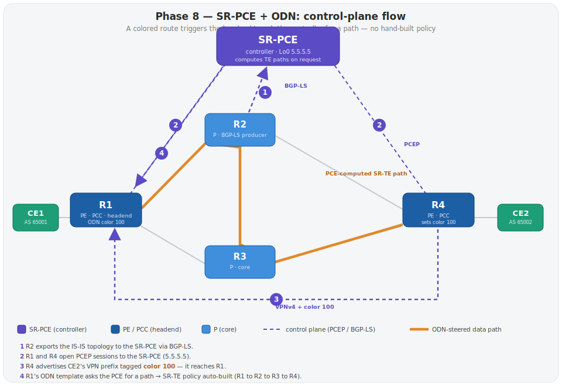

# Phase 8 (Extension) — SR-PCE + ODN: controller-driven SR-TE

> **Status: ✅ BUILT & VERIFIED.** Validated in EVE-NG on 2026-06-27 — real captures in
> [`../notes/phase8-srpce-odn-verify.md`](../notes/phase8-srpce-odn-verify.md): PCE topology
> via BGP-LS, PCEP up, a `Color:100` route auto-creating a PCE-computed policy, and a
> CE3→CE4 ping over it. With `metric type igp` the PCE picks the shortest path.
> *(Forcing a non-shortest path via affinity constraints was attempted but is not exposed
> under `on-demand color` on this XRv9000 build — see "Note on path constraints" below.)*

---



## Why this phase

In **Phase 4** you traffic-engineered by hand: you wrote an explicit segment-list and a
policy on R1 for one destination. That doesn't scale. Phase 8 replaces it with the way
operators actually run SR-TE at scale:

- A central **SR-PCE** (Path Computation Element) learns the whole topology and computes
  TE paths on request.
- The PEs run a **PCC** (Path Computation Client) and talk to the PCE over **PCEP**.
- **ODN** (On-Demand Next-hop) auto-creates an SR-TE policy the moment a **colored**
  service route appears — no per-destination config.

This is the controller-driven, intent-based model behind **5G transport / network
slicing** — directly relevant to a mobile operator.

---

## What's new vs. Phase 7

One new node (the controller) and one new link. Everything else is unchanged.

| Item | Value |
|---|---|
| New node | **PCE** — IOS-XRv9000 acting as SR-PCE |
| PCE Loopback0 | `5.5.5.5/32` (prefix-SID 16005) |
| PCE ↔ R2 link | `10.25.0.0/30` — R2 `Gi0/0/0/2` `.1`, PCE `Gi0/0/0/0` `.2` |
| PCE NET | `49.0001.0000.0000.0005.00` |
| New roles | **PCE** = controller · **PCC** = R1, R4 (headends) · **BGP-LS producer** = R2 |
| Service color | **100** (= "TE intent", e.g. low-latency) |

The PCE is a **leaf** off R2 — single-homed, so it's never a transit hop. It exists to
*compute* paths, not carry traffic.

```
        (existing diamond: R1–R2–R3–R4 + CE1/CE2)
                         |
                    R2 Gi0/0/0/2
                         | 10.25.0.0/30
                    PCE Gi0/0/0/0
                  +-------------+
                  |  SR-PCE     |  Lo0 5.5.5.5
                  | (controller)|
                  +-------------+
```

---

## How it works (the color → ODN → PCE flow)

1. **R2 feeds topology to the PCE.** IS-IS knows the whole topology; R2 exports it into
   **BGP-LS** and iBGP-peers the link-state address-family to the PCE. The PCE now has a
   live map of the network.
2. **R1/R4 register as PCCs.** Each headend opens a **PCEP** session to the PCE
   (`5.5.5.5`).
3. **R4 colors its customer routes.** When R4 advertises CE4's prefixes over VPNv4, it
   stamps **color 100** on them.
4. **ODN fires on R1.** R1 receives a route with color 100 and endpoint `4.4.4.4`, sees
   it has an **on-demand color 100** template, and asks the **PCE** (via PCEP) to compute
   a path to 4.4.4.4 meeting the template's metric/constraints.
5. **The PCE computes and returns the path;** R1 instantiates an SR-TE policy on the fly
   and steers the colored traffic onto it. No explicit segment-list, no per-destination
   config. Remove the route → the policy tears down.

---

## Configs

### A. The SR-PCE node (`PCE`)

```
hostname PCE
!
interface Loopback0
 ipv4 address 5.5.5.5 255.255.255.255
!
interface GigabitEthernet0/0/0/0
 ipv4 address 10.25.0.2 255.255.255.252      ! link to R2
!
router isis CORE                             ! join IS-IS just to be reachable (leaf)
 is-type level-2-only
 net 49.0001.0000.0000.0005.00
 address-family ipv4 unicast
  metric-style wide
  segment-routing mpls
 !
 interface Loopback0
  passive
  address-family ipv4 unicast
   prefix-sid index 5
  !
 !
 interface GigabitEthernet0/0/0/0
  point-to-point
  address-family ipv4 unicast
  !
 !
!
router bgp 100
 address-family link-state link-state        ! (1) learn topology via BGP-LS
 !
 neighbor 2.2.2.2                             ! peer the BGP-LS producer (R2)
  remote-as 100
  update-source Loopback0
  address-family link-state link-state
 !
!
pce
 address ipv4 5.5.5.5                         ! (2) this box IS the PCE, at 5.5.5.5
!
```

1. **`address-family link-state link-state`** — BGP-LS, the family that carries the
   IGP topology as BGP routes. The PCE consumes it to build its TE database.
2. **`pce / address ipv4 5.5.5.5`** — turns this router into a PCEP **server** (the
   PCE) listening on its loopback. PCCs connect here.

### B. BGP-LS producer (`R2`) — export the topology

```
interface GigabitEthernet0/0/0/2
 ipv4 address 10.25.0.1 255.255.255.252       ! new link to PCE
!
router isis CORE
 distribute link-state instance-id 32767      ! (1) push IS-IS topology into BGP-LS
 interface GigabitEthernet0/0/0/2
  point-to-point
  address-family ipv4 unicast
  !
 !
!
router bgp 100
 address-family link-state link-state         ! (2) carry link-state routes
 !
 neighbor 5.5.5.5                              ! feed the PCE
  remote-as 100
  update-source Loopback0
  address-family link-state link-state
 !
!
```

1. **`distribute link-state`** (under the IS-IS instance) — the bridge from IGP to
   BGP-LS: it takes the IS-IS link-state DB and makes it available to BGP. Without it,
   BGP-LS has nothing to advertise.
2. **`address-family link-state link-state` + `neighbor 5.5.5.5`** — iBGP-advertise that
   topology to the PCE.

> Only **one** node needs to be the BGP-LS producer (R2 here). It's not traffic-path
> related — just the telemetry feed to the controller.

### C. PCC + ODN template on the headends (`R1`, mirror on `R4`)

```
segment-routing
 traffic-eng
  pcc                                         ! (1) become a Path Computation Client
   source-address ipv4 1.1.1.1                !     (4.4.4.4 on R4)
   pce address ipv4 5.5.5.5                   !     talk to the PCE
    precedence 10
   !
   report-all                                 !     report our SR-TE policies to the PCE
  !
  on-demand color 100                         ! (2) the ODN template for color 100
   dynamic
    pcep                                       !     delegate path computation to the PCE
    !
    metric
     type igp                                  !     optimize on IGP metric (or 'latency'/'te')
    !
   !
  !
 !
!
```

1. **`pcc`** — registers the headend with the PCE over PCEP (`source-address` = our
   loopback, `pce address` = the controller). `report-all` lets the PCE see the policies
   it manages.
2. **`on-demand color 100`** — the ODN **template**. It says: "for any colored-100 route,
   build a **dynamic** SR-TE policy, and **delegate the computation to the PCE** (`pcep`),
   optimizing the **IGP** metric." Swap `type igp` for `type latency` or `type te` to
   change the intent; add constraints (affinity, disjoint) here too.

> No segment-list, no endpoint, no per-destination policy — the template is generic. The
> *endpoint* comes from the route's BGP next-hop; the *trigger* is the color.

### D. Color the service routes on the egress PE (`R4`)

```
extcommunity-set opaque COLOR-100
  100
end-set
!
route-policy SET-COLOR-100
  set extcommunity color COLOR-100
  pass
end-policy
!
router bgp 100
 neighbor 1.1.1.1                              ! the other PE (R1)
  address-family vpnv4 unicast
   route-policy SET-COLOR-100 out              ! stamp color 100 on VPNv4 routes we send
  !
 !
!
```

This is the trigger. R4 attaches **color 100** to the VPNv4 routes it advertises to R1.
When R1 imports CE4's prefix (`44.44.44.44`) carrying color 100, its ODN template (C-2)
instantiates a PCE-computed policy to endpoint `4.4.4.4`. (To color in the other direction
too, mirror this on R1 toward R4.)

---

## ✅ Verify (and what to look for)

**On the PCE:**
```
show pce ipv4 topology summary     ! PCE has a full node/link count (got BGP-LS)
show pce lsp                        ! the delegated/computed LSPs appear here
show pce association                ! PCC sessions
```
- Topology summary lists all 5 nodes + links → BGP-LS feed works.

**On R2 (producer):**
```
show bgp link-state link-state summary    ! BGP-LS session to PCE up, prefixes sent
```

**On R1 (PCC / headend):**
```
show segment-routing traffic-eng pcc ipv4 peer   ! PCEP session to 5.5.5.5 = UP
show bgp vrf CUST-A 44.44.44.44/32 detail         ! route carries Color:100 extcommunity
show segment-routing traffic-eng policy           ! a color-100 policy auto-appeared...
```
- The auto-created policy should show **`Color: 100, End-point: 4.4.4.4`**, candidate path
  type **dynamic / on-demand**, and computed **by the PCE** (delegated), *not* an explicit
  segment-list you typed.
```
! from CE3:  traceroute 44.44.44.44 source 33.33.33.33   ! follows the PCE-computed path
```

---

## How this replaces Phase 4

| | Phase 4 (manual SR-TE) | Phase 8 (SR-PCE + ODN) |
|---|---|---|
| Who computes the path | you, by hand | the SR-PCE |
| Policy creation | static, per-destination | on-demand, per-color |
| Trigger | `autoroute include` | a colored BGP route |
| Scales to many services? | no | yes |
| Path recompute on failure | manual | PCE recomputes |

Phase 4 taught you *what* an SR-TE policy is. Phase 8 is how that policy gets built and
maintained automatically in a real network.

---

## Note on path constraints (visible steering)

With `metric type igp`, the PCE returns the **shortest** path, so a traceroute looks like
ordinary routing — the automation is real but not visually obvious. A natural next step is
to force a *non-shortest* path (e.g. an **affinity** constraint excluding certain links, or
a **disjoint-path** between two colors — the network-slicing pattern).

**Tested result on this lab (XRv9000, ~24.3.1):** affinity path-constraints are **not
exposed under `on-demand color`** on this image — walking the CLI, `constraints` offers
only `apply-group / exclude-group / resources / segments`, and `segments` only
`protection / sid-algorithm`; there is no `affinity` option for ODN here. So on this build,
ODN computes shortest-path and that's the verified behaviour. Visible non-shortest steering
would need a different mechanism (a **non-ODN** SR-TE policy with an explicit/constrained
path, as in Phase 4) or a platform/image that exposes ODN affinity constraints. Left as a
future exercise rather than shipped unverified.

---

## Build notes / gotchas to watch for

- **Order:** bring up the PCE's IS-IS + BGP-LS first (PCE must *have* topology), then the
  PCCs, then color the routes. A PCC with no PCE topology can't get a path.
- **Reachability:** the PCC must reach `5.5.5.5` (PCEP is TCP) — that's why the PCE is in
  IS-IS. Check `ping 5.5.5.5 source Loopback0` from R1 first.
- **`distribute link-state`** goes on the producer's IS-IS *instance*, not an interface.
- If the ODN policy never appears, check (in order): PCEP session up? route actually
  carrying color 100 (`show bgp … detail`)? template color matches the route color?
- Capture all of the above into `notes/phase8-srpce-odn-verify.md` once it's working.

---

*Extension to the 7-phase lab in [`../README.md`](../README.md). Builds directly on Phase 4
(SR-TE) and Phase 5 (L3VPN).*
